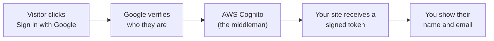
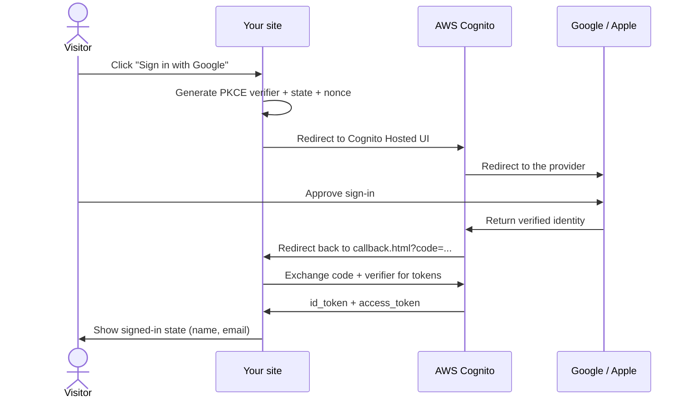
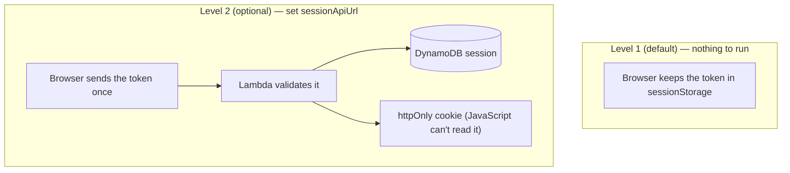

# social-login-starter

Add **Sign in with Google** and **Sign in with Apple** to any website — no passwords to manage, powered by AWS Cognito.

[](https://github.com/monahand1023/social-login-starter/actions/workflows/ci.yml)
[](LICENSE)

> [!NOTE]
> **Status: proof-of-concept / starting point — a base to build on, not a turnkey production service.** The code is unit-tested and the CloudFormation lints clean, but it has **not** been run end-to-end against live Google / Apple / AWS. Validate it in your own account before relying on it, and see [What this does — and what it doesn't](#what-this-does--and-what-it-doesnt) for the explicit non-goals.

---

## What this is (60-second read)

When someone clicks "Sign in with Google" on your site, you don't want to deal with storing passwords, hashing, reset emails, or breaches. Instead, you hand that responsibility to Google (or Apple): they check who the person is and send your site a signed note — "this is alice@example.com, I verified it" — via a middleman called **AWS Cognito**.

Cognito is the translator between your site and the identity providers. It speaks Google's and Apple's OAuth protocols for you, manages the Hosted UI sign-in page, and hands your JavaScript a standard ID token (a JWT) when the sign-in completes. You read the token, show the user's name and email, and you're done. No password database, no email verification loops, no GDPR nightmare — Google and Apple already handle that.

This starter wires all of that up with a **no-build, no-framework** vanilla JS frontend plus a CloudFormation template that deploys the Cognito backend in one command. The four values Cognito prints after deploy go into one config file (`config.js`). That's it.

---

## How it works

**The 30-second version** — your site never sees a password. Google or Apple vouches for the user, and AWS Cognito relays a signed token to your page:



**The detailed version** — under the hood it's an OAuth 2.0 Authorization Code flow with PKCE. You don't need to follow every arrow; `js/auth.js` does it all for you:



**Where the login lives** — by default the token stays in the browser (Level 1, no backend to run). Later, if you want server-side sessions, you flip on the optional Level 2 backend by setting a single config value:



Level 1 is all most sites need. Level 2 is documented in [docs/07-level-2-backend.md](docs/07-level-2-backend.md).

---

## What this does — and what it doesn't

### ✅ What you get
- **"Sign in with Google" and "Sign in with Apple"** on any static website — plain HTML/CSS/JS, no React, no build step.
- A **one-command AWS deploy** (CloudFormation) for the Cognito backend, plus a click-by-click console fallback if you prefer the GUI.
- The **secure OAuth flow done correctly** — Authorization Code + PKCE, with `state` and `nonce` checks — without you having to implement it.
- **Beginner docs that assume nothing** — including creating your Google and Apple developer accounts from scratch.
- An **optional Level 2 backend** for httpOnly-cookie sessions when you outgrow browser-held tokens.

### 🚫 What this is NOT (so nothing surprises you)
- **Not a full user-management system.** You learn *who is signed in* (their email, name, a stable user id). There are no profile pages, roles/permissions, an admin dashboard, or a "manage users" UI — that's yours to build on top.
- **No password or email/magic-link login.** Sign-in is Google and Apple only. (That's the point — no passwords for you to store or leak.)
- **No other providers wired up** (Facebook, GitHub, Microsoft, LINE…). Cognito *can* add them; this starter deliberately doesn't, to stay simple.
- **Not a hosted service.** It runs in *your* AWS account. You own the Cognito user pool and any cost past the free tier (which is generous — see [Cost](#cost)).
- **No MFA, no "remember me"/token refresh, no internationalization** out of the box. These are intentionally left for you to add.
- **Not a substitute for the providers' own rules.** Apple requires a paid ($99/year) developer account; Google may show an "unverified app" screen until you publish your consent screen. The docs walk you through both — but Apple's and Google's policies are theirs, not ours.

If any "is NOT" item is a dealbreaker, better to know now than 40 minutes in.

---

## Demo

Run `npm run serve` and open `http://localhost:8000`, then click a sign-in button to try the live flow.

---

## Vibe-code this (recommended)

You do **not** need to understand OAuth, AWS, or CloudFormation to use this. If you're working with Claude Code, Cursor, GitHub Copilot, or any other AI coding assistant, paste the block below as your **first message** and let it drive:

```
I want to add Google and Apple login to my website using this repo.
Read the docs/ folder in order (01 → 06) and walk me through it
ONE step at a time: ask me for one piece of information at a time,
wait for my answer, and don't move on until each step actually works.
I may not have a Google Cloud or Apple developer account yet —
help me create those too. Start with docs/01-what-you-need.md.
```

**Only want Google** (skip the $99/year Apple account)? Add one line: *"Skip Apple — Google only for now."* You can add Apple later with no code changes.

**Why this works well:** the repo ships a [`CLAUDE.md`](CLAUDE.md) / [`AGENTS.md`](AGENTS.md) at its root, so your assistant already has the mental model, the file map, the gotchas (where secrets go, the predictable-domain trick, the public-client rule), and a troubleshooting playbook. It follows *this* repo's flow instead of hallucinating generic OAuth advice. It will gather your AWS region, then your Google credentials, then Apple (or skip it), deploy with you, and serve the demo — one question at a time so nothing gets missed.

Prefer to read and click yourself? The [Quickstart](#quickstart) below links the same docs in order.

---

## What's in the box

```
social-login-starter/
├── config.example.js          # Copy to config.js; fill in 4 values from deploy output
├── index.html                 # Demo home page — sign-in buttons + signed-in state
├── callback.html              # OAuth redirect target — exchanges code for tokens
├── js/
│   ├── auth.js                # PKCE + token exchange + session helpers (no dependencies)
│   └── validate-config.js     # Catches placeholder/malformed config.js values early
├── css/styles.css             # Demo styles — provider-branded buttons, themeable
├── infra/
│   ├── cognito.yaml           # CloudFormation: user pool, Google+Apple IdPs, public client
│   ├── deploy.sh              # One-command deploy → prints the 4 values for config.js
│   └── parameters.example.sh  # Copy to parameters.sh; fill in your secrets (gitignored)
├── docs/
│   ├── 01-what-you-need.md    # Prerequisites checklist + plain-language explainer
│   ├── 02-google-setup.md     # Google Cloud Console walkthrough (OAuth client + redirect URL)
│   ├── 03-apple-setup.md      # Apple Developer walkthrough (Services ID + .p8 key)
│   ├── 04-deploy-cognito.md   # Run deploy.sh (or console fallback) → copy 4 values
│   ├── 05-run-the-demo.md     # Serve locally, smoke-test sign-in end to end
│   ├── 06-add-to-your-site.md # Drop the 3 files into your existing site
│   ├── 07-level-2-backend.md  # Optional: move tokens into httpOnly cookies (server-side)
│   └── 08-troubleshooting.md  # Error → cause → fix for the most common OAuth failures
└── backend-optional/          # Optional Node.js Lambda: httpOnly session cookies (Level 2)
```

---

## Quickstart

Follow the docs in order. Estimated time: **~30–45 minutes**, most of it clicking around the Google and Apple consoles — the actual deploy is one command.

1. [What you need](docs/01-what-you-need.md) — AWS account, Google account, optional Apple developer account
2. [Set up Google sign-in](docs/02-google-setup.md) — create an OAuth client, set the redirect URL
3. [Set up Apple sign-in](docs/03-apple-setup.md) — create a Services ID and download a .p8 key *(skip if you only want Google)*
4. [Deploy Cognito](docs/04-deploy-cognito.md) — run `./infra/deploy.sh`, copy 4 values into `config.js`
5. [Run the demo](docs/05-run-the-demo.md) — `npm run serve`, open `http://localhost:8000`, sign in

---

## Cost

**AWS Cognito:** free for up to 50,000 Monthly Active Users (the free tier covers virtually all hobby and small-production uses). After that, pricing is a few cents per MAU — see the [Cognito pricing page](https://aws.amazon.com/cognito/pricing/).

**Google sign-in:** free, no account fees.

**Apple sign-in:** requires an [Apple Developer account](https://developer.apple.com/programs/) at **$99/year**. This cost is only incurred if you want "Sign in with Apple" — Google sign-in works without it.

**The demo itself:** no server, no database, no always-on compute. The only AWS resource is the Cognito user pool.

---

## Security

`config.js` contains four values — `region`, `userPoolId`, `clientId`, and `domain`. **All four are public by design.** A Cognito app client with no client secret is specifically designed to live in browser JavaScript; there is nothing sensitive about these values. Committing them is fine.

Your real secrets — the Google client secret and the Apple `.p8` private key — only ever go into AWS (via `infra/parameters.sh`, which is gitignored). They are never written to `config.js` or any committed file.

For additional hardening (moving tokens out of browser sessionStorage into httpOnly cookies), see [docs/07-level-2-backend.md](docs/07-level-2-backend.md) and the `backend-optional/` directory.

For common error messages and fixes, see [docs/08-troubleshooting.md](docs/08-troubleshooting.md).

---

## Run the tests

```bash
npm test
```

Runs the config validator tests (`test/validate-config.test.js`) and the auth helper tests (`test/auth-helpers.test.js`) using Node's built-in test runner — no additional dependencies required.

---

## License

[MIT](LICENSE) — use freely, attribution appreciated but not required.
